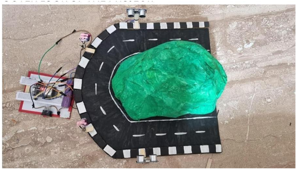
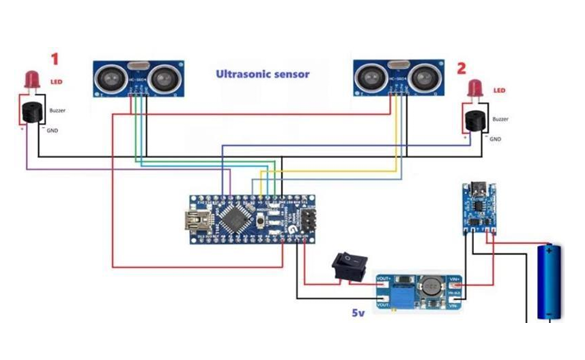

# Blind Spot Detection & Driver Warning System using ESP32

> Engineering Clinic Project | VIT-AP University

## 📖 Overview

Blind Spot Detection & Driver Warning System is an embedded systems project designed to improve road safety by detecting nearby obstacles and alerting the driver using visual and audio indicators.

The system uses two HC-SR04 ultrasonic sensors connected to an ESP32 development board. When an obstacle enters a predefined safety distance, the corresponding LED and buzzer are activated, providing an immediate warning to the driver.

---

## 📷 Prototype



---

## 🔌 Circuit Diagram



---

## ✨ Features

- Blind spot detection
- Real-time obstacle monitoring
- Audio warning using buzzers
- Visual warning using LEDs
- Low-cost driver assistance prototype
- Easy hardware integration

---

## ⚙️ Hardware Components

- ESP32 Development Board
- 2 × HC-SR04 Ultrasonic Sensors
- 2 × LEDs
- 2 × Active Buzzers
- Breadboard
- Power Booster Module
- 3.7V Battery

---

## 💻 Software Used

- Arduino IDE
- Embedded C++
- ESP32 Platform

---

## 🛠️ Working Principle

1. Ultrasonic sensors continuously measure the surrounding distance.
2. ESP32 processes the measured values.
3. If an obstacle is detected within the safety threshold:
   - Corresponding LED turns ON.
   - Corresponding buzzer sounds.
4. The driver receives an immediate warning.

---

## 📂 Repository Structure

```
blind-spot-detection-esp32/
│
├── Code/
│   ├── blind_spot_detection.ino
│   └── README.md
│
├── Images/
│   ├── prototype.jpg.png
│   └── esp32_circuit_diagram.png.png
│
├── Presentation/
│
├── Report/
│
├── README.md
└── LICENSE
```

---

## 🚀 Future Improvements

- Camera-based blind spot detection
- AI object recognition
- Bluetooth mobile alerts
- OLED display
- Vehicle CAN Bus integration
- Radar sensors

---

## 👨‍💻 Technologies

- ESP32
- Embedded Systems
- Arduino IDE
- Embedded C++
- IoT
- Electronics
- Ultrasonic Sensors

---

## 📜 License

This project is released under the MIT License.

---

## 👥 Contributors

- Shaik Abdul Raheem
- Engineering Clinic Team
- VIT-AP University
